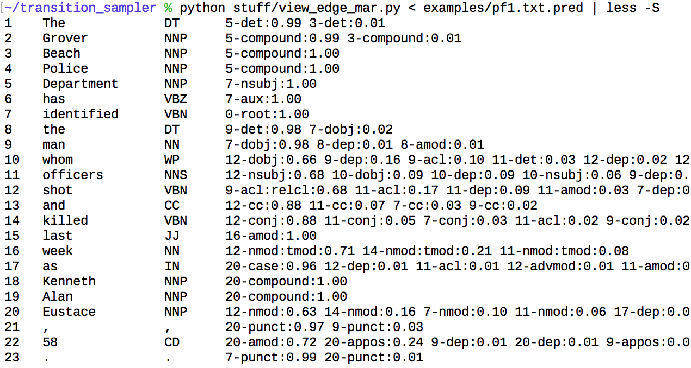

This code is for the paper:

    Monte Carlo Syntax Marginals for Exploring and Using Dependency Parses
    Katherine A. Keith, Su Lin Blodgett, and Brendan O'Connor
    Proceedings of NAACL, 2018

# Files

- `add_sampler_to_corenlp_nndep.diff`: to run the transition sampler (see below)
- `corenlp` symlink: to help run the transition sampler (see below)
- `examples/`: Parse samples for a few example sentences.
- `parsetext.sh`: runs the transition sampler (see below)
- `stuff/`: Analysis scripts for parse samples.
- `srl_experiments/`: scripts and notes from the SRL (semantic role assignment) experiment
- `pf/`: scripts and notes from the police fatalities experiment
- `ud_parses/`: experiments on the UD 1.3 dev set, specifically for path prediction and its precision-recall and calibration.

The `stuff/` directory includes lots of parse output too, as zip files.  The path marginals output used for `ud_parses/` is a bit larger (~925MB uncompressed, 53MB compressed) so isn't included, but ask us if you need it.

# Running the transition sampler

Requires Java to be installed and runnable.  Uses a precompiled version we checked in to the repository.

1. Download stanford-corenlp-full-2017-06-09 (same as version 3.8.0) from https://stanfordnlp.github.io/CoreNLP/download.html

2. Unzip it in this directory.

3. `unzip target_prebuilt.zip`

4. Now you should be able to run:

        echo -e "I saw the house with a fork.\n\nI saw the house with a chimney.\n\nI saw the house with a telescope." > doc.txt

        ./parsetext.sh doc.txt

That first creates `doc.txt.conllu` (for its tokenization, and incidentally with a greedy decoding too), and second, it outputs `doc.txt.pred` with the samples.

Each tree sample is a column.  Columns are appended on the right side of the `doc.txt.pred` file.

To view the edge marginals:

```
% python stuff/view_edge_mar.py < doc.txt.pred
1    I               PRP     2-nsubj:1.00
2    saw             VBD     0-root:1.00
3    the             DT      4-det:1.00
4    house           NN      2-dobj:1.00
5    with            IN      7-case:1.00
6    a               DT      7-det:1.00
7    fork            NN      2-nmod:0.88 4-nmod:0.12
8    .               .       2-punct:1.00

1    I               PRP     2-nsubj:1.00
2    saw             VBD     0-root:1.00
3    the             DT      4-det:1.00
4    house           NN      2-dobj:1.00
5    with            IN      7-case:1.00
6    a               DT      7-det:1.00
7    chimney         NN      2-nmod:0.92 4-nmod:0.08
8    .               .       2-punct:1.00

1    I               PRP     2-nsubj:1.00
2    saw             VBD     0-root:1.00
3    the             DT      4-det:1.00
4    house           NN      2-dobj:0.99 2-iobj:0.01
5    with            IN      7-case:1.00
6    a               DT      7-det:0.99 7-dep:0.01
7    telescope       NN      2-nmod:0.90 4-nmod:0.10
8    .               .       2-punct:1.00
```

Or for a more complex example:




# Compiling the transition sampler

`add_sampler_to_corenlp_nndep.diff` is the patch file applied to `src/` from `stanford-corenlp-full-2017-06-09` (from CoreNLP 3.8.0).  We basically only changed one file (`edu/stanford/nlp/parser/nndep/DependencyParser.java`) and added one new file (for convenience - it could be done without if you trust Java's Math.random()).

1. download stanford-corenlp-full-2017-06-09 (same as version 3.8.0 i think)
from https://stanfordnlp.github.io/CoreNLP/download.html

2. unzip ~/Downloads/stanford-corenlp-full-2017-06-09.zip
into this directory.  (the `corenlp` symlink is supposed to point to it now)

3. Copy the src/ dir into this directory and apply the patch.  We actually haven't done this step so are not sure what `patch` options it may require.  To get the source code, this may work:

        mkdir src
        cd src
        jar xf ../corenlp/stanford-corenlp-3.8.0-sources.jar


4. compile java files into .class files in target/classes.  this is the
default way eclipse is set up.  there's probably a commandline invocation of
"javac" that will do it too.  (we did it with eclipse...)  eclipse (or javac) will need to be told about
all the .jar dependencies in corenlp's base dir.
See directions below.

4. now the following should hopefully work.
(.jar dependencies aren't actually needed for runtime.  yay!  that's simpler.)

    java -cp "target/classes/" edu.stanford.nlp.parser.nndep.DependencyParser -model stuff/english_UD.gz -testFile doc.txt.conllu -outFile pred -numSamples 10


# Miscellaneous notes

The checked-in UD model is simply from `jar xf stanford-corenlp-3.8.0-models.jar edu/stanford/nlp/models/parser/nndep/english_UD.gz`

To use Eclipse ... not recommended, but it worked for us...

ECLIPSE: File -> Open Project from Filesystem

ECLIPSE: project properties (Right click) -> Java Build Path -> Add Jars.  dont use the stanford-corenlp jars, since those are precompied ones. but all the other (non-source) jars are dependencies so they're needed.

FILESYSTEM: .class files will get built into target/classes or something.

RUNNING IT: using the Eclipse-compiled variant.  Modify DependencyParser.java to have System.out.println("HERE") or somehting like that then do

java -cp "*.jar:target/classes" edu.stanford.nlp.parser.nndep.DependencyParser

need the HERE test to make sure the right version of DependencyParser is used.  the "*.jar" is including stanford-corenlp-3.8.0.jar ... which has the pre-compiled version of DependencyParser.  I think what happens is the target/classes version overrides it.  I guess you could delete stanford-corenlp-3.8.0.jar to be safe.
